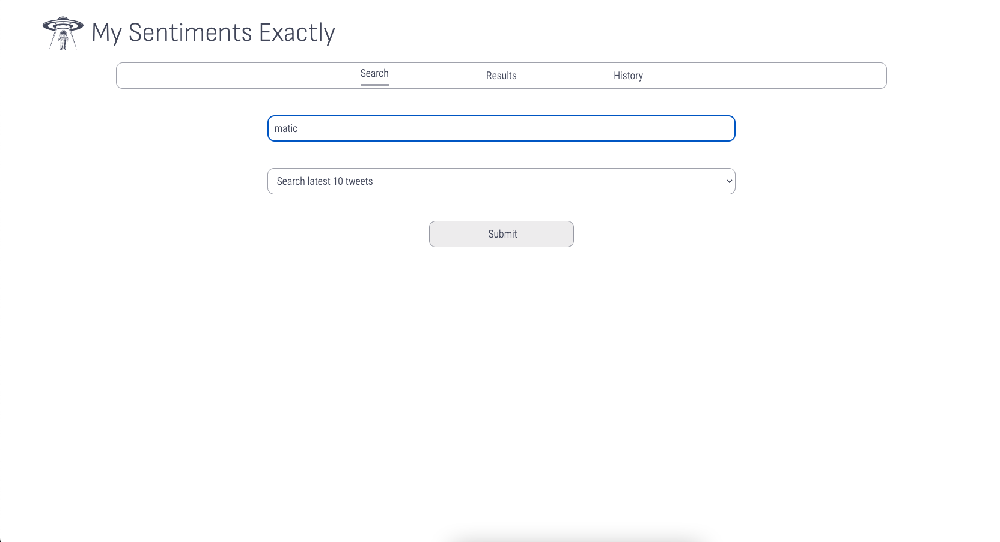
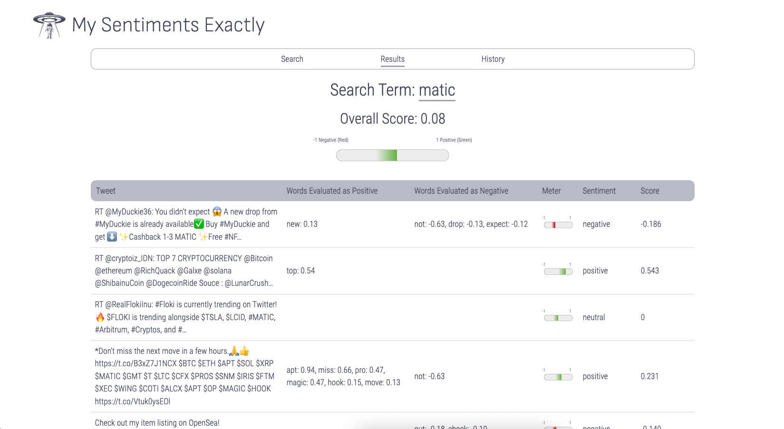
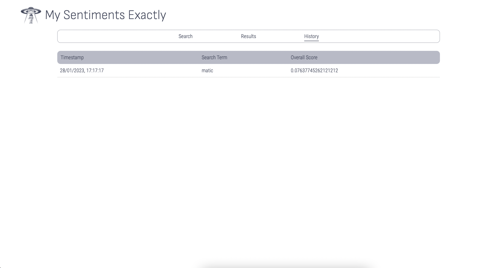

## Intro

My Sentiments Exactly allows one to check the latest sentiments on Twitter based on a search term entered by the user. User can select to search latest 10, 15, 20 or 25 tweets.

To start the app, please visit https://cors-anywhere.herokuapp.com/corsdemo and click for "Request temporary access to the demo server".

## Technologies Used

1. Built using React framework
   a. 10 components
   b. 4 props
   c. 1 lifting state to pass back user searched query to parent component
   d. useState hooks to track 8 states
   e. React Router to create Search, Results and History pages
   f. useContext hooks to read and subscribe to 13 context

2. Twitter API to fetch tweets and Twinword API to analyze tweets

3. Native CSS for styling

## Wireframe

## Hierarchy

## User Stories

Users should be able to:

1. Enter any search term into the search bar

2. Select 10, 15, 20 or 25 most recent tweets to conduct the search on using a dropdown menu

3. View a list of tweets and its corresponding results in the Results page. Results should contain individual score for each tweet (a positive tweet will be indicated by a positive score and vice versa), with a list of words from the tweet that had been evaluated as positive and/or negative.

4. View an overall score of the total tweets.

5. Click onto History tab to view previous search terms and corresponding overall scores.

6. Click onto Search tab to begin a new search.

## Limitations and Future Goals

1. On Search page:
   a. User can search for tweets by languages, users, geographic location instead of being limited to a high level search now
   b. User can enter the number of tweets he/she would like to search for instead of being limited to max 25 tweets now

2. On Results page:
   a. User can click onto each tweet to direct them to the original tweet from Twitter / User can view the tweet in its original form, i.e. who tweeted it, date and time of tweet etc on the results page itself instead of just the tweet text being displayed now
   b. To use a more advanced sentiment analysis tool for more accurate analysis

3. On History page:
   a. User can sort and filter by date search, search term, overall scores

4. Add a Watchlist page so that a user can create his or her own watchlist, which will load each time the user logs in. Example use case: A crypto investor may be too busy to read up on crypto twitter's sentiments for the day and can quickly log in to view this dashboard to have a quick sense check before making any potential investment decisions.

5. Add more API sources apart from Twitter so that user can have an overview of sentiments from various social media sources.

6. Deploy own proxy with code so that user need not allow access from server each time he/she starts a browsing session.

## Acknowledgements

1. Twitter API - https://developer.twitter.com/en/docs/twitter-api
2. Twinword API - https://www.twinword.com/api/sentiment-analysis.php
3. Credits to this discussion which guided on how to use a CORS proxy to avoid the "No Access-Control-Allow-Origin-Header" problems - https://stackoverflow.com/questions/43871637/no-access-control-allow-origin-header-is-present-on-the-requested-resource-whe/43881141#43881141
